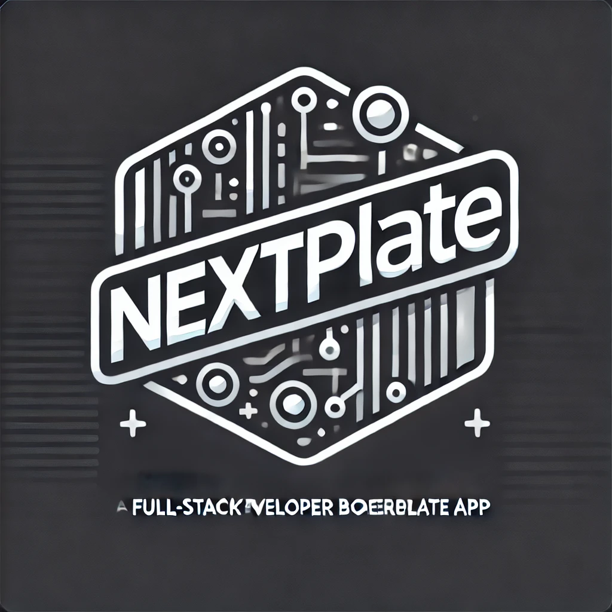

# NextPlate

<div align="center">
  

  <h3 align="center">Advanced Next.js Boilerplate for Modern Web Applications</h3>

  <p align="center">
    A production-ready template for building scalable, multilingual web applications with authentication, payments, and AI integrations.
    <br />
    <a href="https://nextplate.demo.com"><strong>View Demo »</strong></a>
    <br />
    <br />
    <a href="#getting-started">Quick Start</a>
    ·
    <a href="#documentation">Documentation</a>
    ·
    <a href="#features">Features</a>
    ·
    <a href="https://github.com/yourusername/nextplate/issues">Report Bug</a>
  </p>
</div>

<p align="center">
  <a href="https://github.com/yourusername/nextplate/stargazers">
    
  </a>
  <a href="https://github.com/yourusername/nextplate/network/members">
    
  </a>
  <a href="https://github.com/yourusername/nextplate/issues">
    
  </a>
  <a href="https://github.com/yourusername/nextplate/blob/main/LICENSE">
    
  </a>
</p>

## 📋 Table of Contents

- [About The Project](#about-the-project)
- [Features](#features)
- [Built With](#built-with)
- [Getting Started](#getting-started)
  - [Prerequisites](#prerequisites)
  - [Installation](#installation)
  - [Environment Setup](#environment-setup)
- [Core Integrations](#core-integrations)
  - [Supabase & Mailgun](#supabase--mailgun)
  - [Stripe Integration](#stripe-integration)
  - [OpenAI API](#openai-api)
- [Documentation](#documentation)
- [Architecture](#architecture)
- [Best Practices](#best-practices)
- [Roadmap](#roadmap)
- [Contributing](#contributing)
- [License](#license)
- [Contact](#contact)

## 🚀 About The Project

NextPlate is an advanced Next.js boilerplate designed for full-stack developers who want to rapidly build scalable, modern web applications compliant with legal standards. It combines the best tools from the Next.js ecosystem with a focus on regulatory compliance, offering a complete solution that significantly reduces setup time and allows developers to focus on their specific business logic.

### Why NextPlate?

- **Save Development Time**: Start with authentication, payments, and AI already integrated.
- **Best Practices Built-in**: Implements SOLID principles and clean code practices.
- **Fully Typed**: Built with TypeScript for better development experience.
- **Internationalization**: Supports multiple languages out of the box.
- **Legal Compliance**: Includes customizable legal documents and cookie consent banner.

## ✨ Features

NextPlate includes a comprehensive set of features to accelerate your web application development:

### 🔐 Authentication & User Management
- Secure authentication through Supabase
- Email/password and social login options
- Password reset and email verification
- User profile management

### 💳 Payment Processing
- Stripe integration for payments and subscriptions
- Webhook handling for payment events
- Subscription management interfaces

### 🌐 Internationalization
- Multi-language support (English and Spanish included)
- Easy translation management
- RTL support

### 🎨 UI/UX
- Modern UI components with shadcn/ui
- Responsive design for all devices
- Dark/light mode support
- Accessible components

### 🤖 AI Integration
- OpenAI API integration
- Document search and suggestions
- AI-powered responses
- Smart chatbot implementation

### 🔧 Developer Experience
- TypeScript for type safety
- SOLID architecture principles
- Comprehensive documentation
- Ready-to-deploy configuration

### 📜 Legal Compliance
- GDPR-compliant cookie consent
- Customizable Terms of Service
- Privacy Policy templates
- Data protection features

## 🛠️ Built With

NextPlate leverages modern technologies to provide a robust development experience:

- [Next.js 15.1.6](https://nextjs.org/) - React framework for production
- [TypeScript](https://www.typescriptlang.org/) - JavaScript with syntax for types
- [Supabase](https://supabase.com/) - Open source Firebase alternative
- [Shadcn UI](https://ui.shadcn.com/) - Re-usable UI components
- [Stripe](https://stripe.com/) - Online payment processing
- [OpenAI API](https://openai.com/) - AI capabilities
- [Next-intl](https://next-intl-docs.vercel.app/) - Internationalization
- [Mailgun](https://www.mailgun.com/) - Email delivery service
- [React Cookie Consent](https://www.npmjs.com/package/react-cookie-consent) - Cookie consent banner

## 🏁 Getting Started

Follow these instructions to set up NextPlate locally.

### Prerequisites

- Node.js 18.x or later
- npm or yarn
- A Supabase account
- API keys for Stripe, OpenAI, and Mailgun

### Installation

1. Clone the repository
   ```sh
   git clone https://github.com/yourusername/nextplate.git
   cd nextplate
   ```

2. Install dependencies
   ```sh
   npm install
   # or
   yarn install
   ```

3. Copy example environment file
   ```sh
   cp .env.example .env.local
   ```

4. Start the development server
   ```sh
   npm run dev
   # or
   yarn dev
   ```

### Environment Setup

Configure your `.env.local` with the following variables:

```
# Supabase
NEXT_PUBLIC_SUPABASE_URL=your_supabase_url
NEXT_PUBLIC_SUPABASE_ANON_KEY=your_supabase_anon_key

# Stripe
STRIPE_SECRET_KEY=your_stripe_secret_key
NEXT_PUBLIC_STRIPE_PUBLISHABLE_KEY=your_stripe_publishable_key
STRIPE_WEBHOOK_SECRET=your_stripe_webhook_secret

# OpenAI
OPENAI_API_KEY=your_openai_api_key

# Mailgun
MAILGUN_SMTP_HOST=smtp.mailgun.org
MAILGUN_SMTP_PORT=587
MAILGUN_SMTP_USER=your_mailgun_smtp_user
MAILGUN_SMTP_PASSWORD=your_mailgun_smtp_password
```

## 🔌 Core Integrations

### Supabase & Mailgun

NextPlate uses Supabase for authentication and database, with Mailgun for reliable email delivery:

1. **Authentication Flow**: Secure login, registration, and password recovery
2. **Database Structure**: PostgreSQL tables for users, profiles, and subscriptions
3. **Email Templates**: Customizable templates for authentication emails
4. **Row Level Security**: Pre-configured policies for data protection

See the [Mailgun Configuration Guide](docs/Guía%20de%20Configuración%20de%20Mailgun.txt) for detailed setup instructions.

### Stripe Integration

The payment system integrates Stripe for processing payments and managing subscriptions:

1. **Checkout Flow**: Pre-built checkout pages for products
2. **Webhooks**: Event handling for payment lifecycle
3. **Customer Portal**: User subscription management
4. **Admin Dashboard**: Subscription overview and management

### OpenAI API

NextPlate includes AI capabilities through the OpenAI API:

1. **Document Search**: Smart search across documentation
2. **ChatBot**: AI-powered assistance for users
3. **Content Generation**: Helpers for AI-generated content
4. **Multilingual Support**: AI responses in the user's language

## 📚 Documentation

NextPlate includes comprehensive documentation to help you understand the codebase:

- **Architecture Overview**: High-level system design and component interaction
- **Best Practices Guide**: SOLID principles, clean code, and design patterns
- **API Documentation**: Endpoints and usage examples
- **Component Library**: Available UI components and their usage
- **Internationalization**: How to add new languages and translations

Visit the `/docs` directory for detailed documentation files.

## 🏗️ Architecture

NextPlate follows a robust architecture designed for scalability and maintainability:

```
[User] <--> [Frontend: Next.js Pages] <--> [Backend: Next.js API Routes]
    |                   |                            |
    |                   |                            |
[Supabase Auth]       [Supabase DB]               [Stripe API]
    |                   |                            |
[Mailgun SMTP] <---- [Supabase Auth]              [OpenAI API]
```

The architecture implements separation of concerns and follows the SOLID principles to ensure components are modular and replaceable.

## 🧠 Best Practices

NextPlate is built following software development best practices:

### SOLID Principles
- **Single Responsibility**: Each component has one reason to change
- **Open/Closed**: Open for extension, closed for modification
- **Liskov Substitution**: Derived classes can substitute base classes
- **Interface Segregation**: No client should depend on methods it doesn't use
- **Dependency Inversion**: Depend on abstractions, not concrete implementations

### Clean Code
- Descriptive naming
- Small, focused functions
- Proper error handling
- Minimal dependencies

See our [Best Practices Guide](docs/Guia_de_Mejores_Practicas.txt) for detailed guidance.

## 🛣️ Roadmap

Planned features and improvements:

- [ ] Additional authentication providers
- [ ] Enhanced AI capabilities
- [ ] More UI component examples
- [ ] Performance optimizations
- [ ] Additional language support

## 🤝 Contributing

Contributions are welcome and appreciated! To contribute:

1. Fork the Project
2. Create your Feature Branch (`git checkout -b feature/AmazingFeature`)
3. Commit your Changes (`git commit -m 'Add some AmazingFeature'`)
4. Push to the Branch (`git push origin feature/AmazingFeature`)
5. Open a Pull Request

## 📄 License

Distributed under the MIT License. See `LICENSE` for more information.

## 📬 Contact

Project Link: [https://github.com/yourusername/nextplate](https://github.com/yourusername/nextplate)

---

<p align="center">
  <a href="https://nextplate.demo.com">
    
  </a>
  <p align="center">
    Built with ❤️ for developers who value their time
  </p>
</p>
